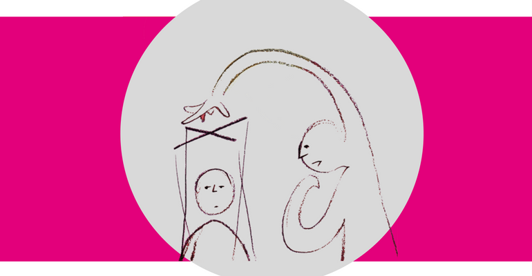

# Hello

How to identify manipulative situations and people, & how to deal with them. Crowdsourced by survivors.

## Hello.

### This guide will help you identify manipulative situations and find support to get yourself out of a controlling relationship.

| **A healthy relationship is...** | A healthy relationship is _**not**_…. |
| :--- | :--- |
| .....balanced and equal. You feel that you can express your views and opinions freely and act on them without fearing a negative reaction. | ...feeling that you are being used by someone that your emotional wellbeing is the cost for their happiness. If you feel like this, you are most likely being manipulated and are in an abusive situation. |

A controlling relationship is one-sided and unstable.

A controlling relationship does not have to be romantic. It is a relationship where you feel you are being emotionally abused or manipulated into doing things \(or put into situations\)that make you feel physically and / or emotionally distressed.

Partners, family members, carers, friends, colleagues to even teachers: anyone could be manipulating you.

> _MANIPULATION_:  
> **the action of indirectly interfering with the decision-making process of another person, particularly in a clever or unscrupulous way.**
>
> _PSYCHOLOGICAL MANIPULATION_    
> **can be abusive, deceptive and sneaky, to make you behave the way the perpetrator wants.**
>
> _EMOTIONAL MANIPULATION_    
> **is meant to confuse you and leave you off-balance, and is often very subtle and deceptive**

This guide has been crowdsourced by [Chayn](http://chayn.co/) volunteers, many of which are survivors of abuse, to help signpost you towards as many of the relevant resources we’ve been able to gather. [Get in touch](https://www.facebook.com/chayn/) if there’s more that we can add. Throughout the guide, we will be using controlling and manipulative interchangeably.

### Who this guide is for:

We are all at risk of being controlled, regardless of our gender identity or sexual orientation.  
It’s not easy to identify abuse in your relationships, especially where there are emotions involved. And it becomes even harder when the perpetrator is not physically harming you. But let’s get one thing straight: mental abuse caused by manipulation is equally harmful.

Moreover there are various social and economic factors that can have an impact some people’s ability to identify and report abuse.  
Sadly, if the manipulator is aware of these vulnerabilities, they may try to exploit them to maintain control over you.

We know that women are more likely to experience abuse but there are other factors that we need to keep in mind. Some groups are more vulnerable than others when it comes to controlling relationships, including \(but not limited to\):

* Minorities and marginalised groups 
* Recent immigrants 
* Elders who are facing abuse and manipulation from caregivers 
* Parents in fear of losing children 
* Individuals in forced marriages 
* Queer communities
* Physically disabled

Here’s the bottom line: If you are in an abusive relationship with anyone, you deserve to get the help you need.

#### Every person has a right to live a life free from abuse.

