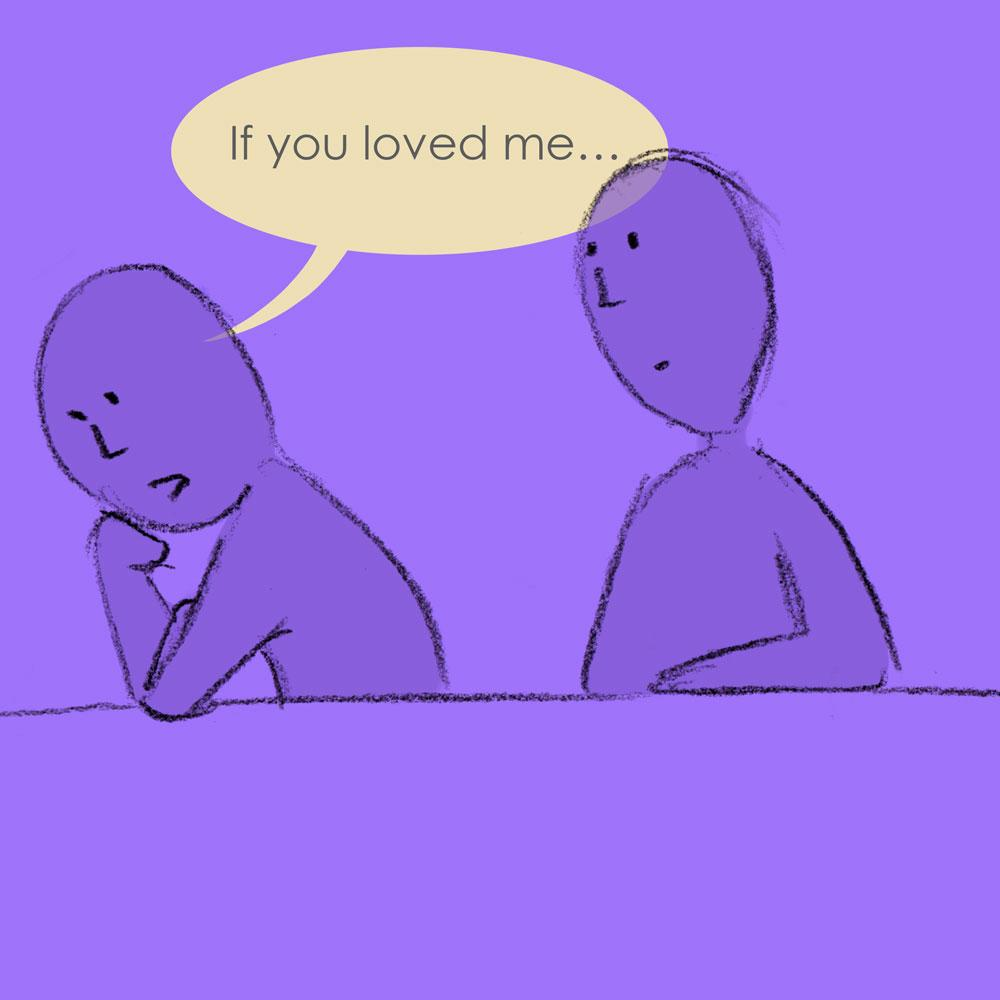
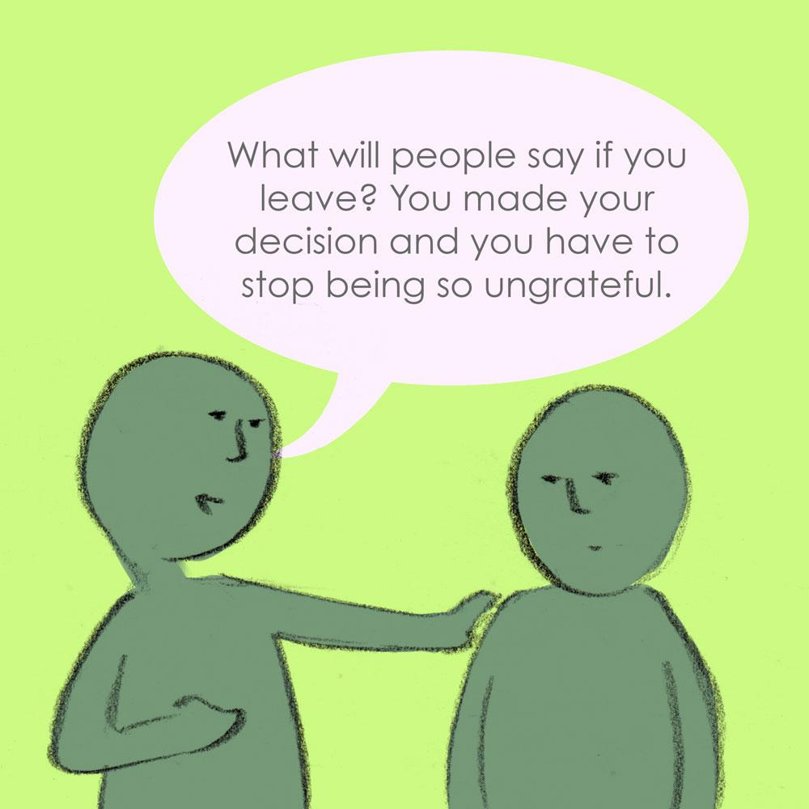
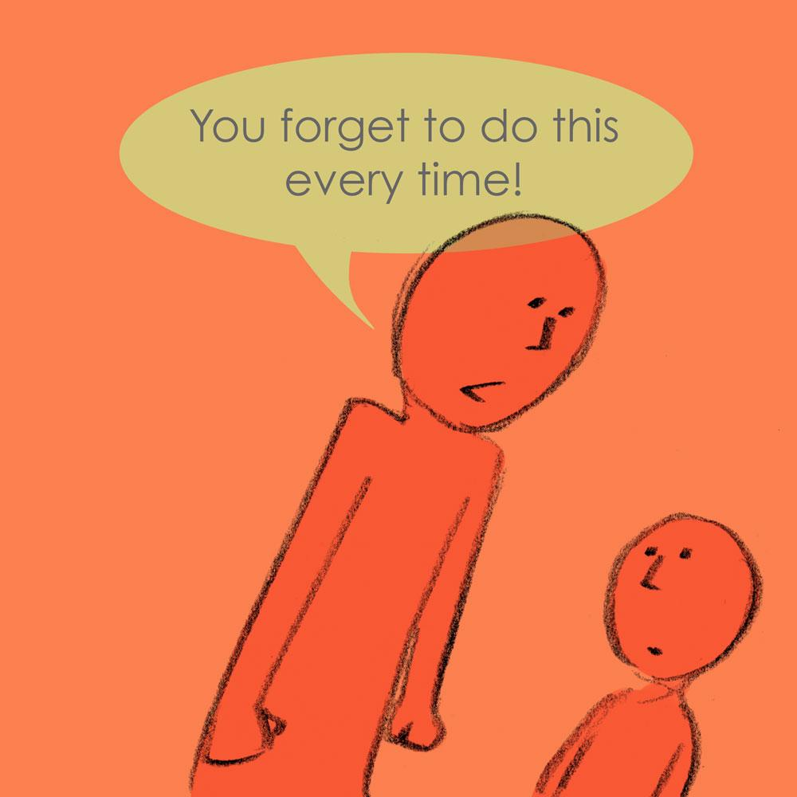
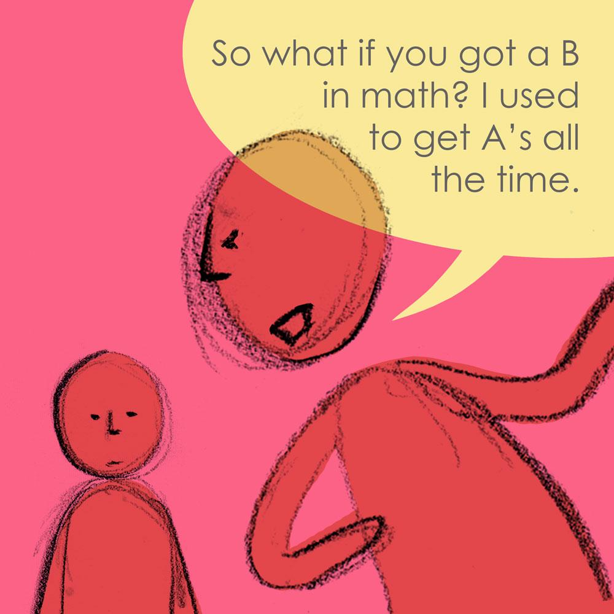

# What does manipulation look like? {#what-does-manipulation-look-like}

There is a difference between healthy social influence and psychological manipulation.

Healthy social influence occurs between most people, and is part of the give and take of constructive relationships. In psychological manipulation, one person is used for the benefit of another. The manipulator deliberately creates an imbalance of power, and exploits the victim to serve his or her agenda.

Do any of these sound familiar to you in any of your relationships?

| This could include spreading misinformation about you to others, and / or emphasising to you that others’ good opinion of you is entirely dependent on their representation of you, and that you have them to thank for your own success. | 

#### **Isolation** {#isolation}

#### This might sound like: &quot;I don&#039;t like your parents, they are not good to you and I don&#039;t want you to see them”, or telling you which friends you’re allowed to see. {#this-might-sound-like-i-don-t-like-your-parents-they-are-not-good-to-you-and-i-don-t-want-you-to-see-them-or-telling-you-which-friends-you-re-allowed-to-see}

 |
| --- | --- |
| This might sound like: &quot;You spend too much on yourself&quot; / &quot;You can&#039;t be trusted with money. It&#039;s best that I&#039;m in charge.&quot; Manipulative people will use financial control methods to gain power and control in relationships. Financial abuse is one of the most powerful ways to keep someone trapped in a relationship, and can take subtle or overt forms to limit access to assets and accessibility to family finances. This is intentional and is used to entrap you in the relationship. | 

#### 

#### **Dependence** {#dependence}

#### This might sound like: “I’d kill myself if you left.”, or actions such as obsessively calling you if you don’t answer. This is a form of emotional blackmail and appears in exaggerated, dramatic language that makes you feel as though the other person’s well-being is entirely your responsibility. {#this-might-sound-like-i-d-kill-myself-if-you-left-or-actions-such-as-obsessively-calling-you-if-you-don-t-answer-this-is-a-form-of-emotional-blackmail-and-appears-in-exaggerated-dramatic-language-that-makes-you-feel-as-though-the-other-person-s-well-being-is-entirely-your-responsibility}

 |
|  | 

####  {#-0}

 |
|  | 

####  {#-1}

 |
|  | 

#### **Using your beliefs to control you** {#using-your-beliefs-to-control-you}

#### This might sound like: “How will I get to heaven if I have a child like you?!” / “You have no respect and will never pray for me when I am gone.” This exploits your beliefs for the benefit of the manipulator, _resulting in controlling you and your actions_. They may refer to your faith or a higher calling as the reason you need to do something, in order to achieve their own goals. {#this-might-sound-like-how-will-i-get-to-heaven-if-i-have-a-child-like-you-you-have-no-respect-and-will-never-pray-for-me-when-i-am-gone-this-exploits-your-beliefs-for-the-benefit-of-the-manipulator-resulting-in-controlling-you-and-your-actions-they-may-refer-to-your-faith-or-a-higher-calling-as-the-reason-you-need-to-do-something-in-order-to-achieve-their-own-goals}

 |
|  | Manipulative people may make themselves out to be the victim to avoid them taking responsibility for their own actions. They may react to your defence _- in family situations this can be seen as “talking back”, and is seen as a sign of insolence and disrespect from you._ They will act as though you are the one who has done something wrong and hurt them. _Remember you have every right to speak up for yourself._ |

####  {#-2}

#### **People will defend your abuser** {#people-will-defend-your-abuser}

#### This might sound like: “I’m sure he / she only has your best interests at heart” / “What did you do to make them feel like that?” / “he / she only yelled at you because you made him / her so angry with what you did” {#this-might-sound-like-i-m-sure-he-she-only-has-your-best-interests-at-heart-what-did-you-do-to-make-them-feel-like-that-he-she-only-yelled-at-you-because-you-made-him-her-so-angry-with-what-you-did}

#### **What happens?** {#what-happens}

| Others around you may not realise the extent or persistence of the manipulative person’s behaviour, as they may be expert at hiding it from others, or they believe the abuser’s lies about you, and may have the same beliefs as the abuser but not agree with their methods. |
| --- |

#### **Keeping the status quo is more important than your health** {#keeping-the-status-quo-is-more-important-than-your-health}

#### This might sound like: “They are old and set in their ways, it’s our culture.” / “They only want the best for you, I can’t believe you are being so dramatic about this / mean to them.” {#this-might-sound-like-they-are-old-and-set-in-their-ways-it-s-our-culture-they-only-want-the-best-for-you-i-can-t-believe-you-are-being-so-dramatic-about-this-mean-to-them}

#### **What happens?** {#what-happens-0}

| People will make excuses for an abuser&#039;s behaviour, this is even if they know the damage they are inflicting. They will ignore the issue, make excuses, believe the abuser’s lies about you, and in certain cultural contexts may not agree with the abuser’s methods but fundamentally have the same beliefs as the abuser. |
| --- |

#### **Silent treatment** {#silent-treatment}

#### This might sound like: “Why am I such an awful person…” / “How can I make this better…” / “It doesn’t matter I’m upset, that’s because I’ve made them angry…” {#this-might-sound-like-why-am-i-such-an-awful-person-how-can-i-make-this-better-it-doesn-t-matter-i-m-upset-that-s-because-i-ve-made-them-angry}

####  {#-3}

####  {#-4}

#### **What happens?** {#what-happens-1}

| Manipulative people may stop talking to you completely to exert pressure upon you, and to coerce you into what they want you to do, and see how long it will take you before you break down. One person shares that: _“My very first boyfriend did this when I didn&#039;t want to have sex. He literally turned his back on me, and didn&#039;t respond to anything until I agreed to have sex. No violence involved, but very damaging still…”_ |
| --- |

#### **The ‘no way out’ question** {#the-no-way-out-question}

#### This might sound like: “How could you say that to me?” {#this-might-sound-like-how-could-you-say-that-to-me}

####  {#-5}

####  {#-6}

####  {#-7}

#### **What happens?** {#what-happens-2}

| You might think you are given a choice by being asked a question but the answer has already been decided by the manipulator. Usually, after such a question, there is a pause and people are usually programmed to respond to a conversational pause by offering to help, hence you might just do whatever the manipulator wants you to do. |
| --- |

#### **A question disguised as a statement** {#a-question-disguised-as-a-statement}

#### This might sound like: “I was wondering why you…” / “Perhaps you could…” / “I wish you would…” {#this-might-sound-like-i-was-wondering-why-you-perhaps-you-could-i-wish-you-would}

####  {#-8}

####  {#-9}

####  {#-10}

#### **What happens?** {#what-happens-3}

| Manipulative people avoid asking questions because they do not want to lose control. So instead they frame statements as questions. |
| --- |

####  {#-11}

#### **Lies** {#lies}

#### This might sound like: “They only like you because I lie to them about you!” / “I never said that! You are imagining things again.” or “You are nowhere near as beautiful as she is” / “You are nothing compared to them”. {#this-might-sound-like-they-only-like-you-because-i-lie-to-them-about-you-i-never-said-that-you-are-imagining-things-again-or-you-are-nowhere-near-as-beautiful-as-she-is-you-are-nothing-compared-to-them}

#### **What happens?** {#what-happens-4}

| Manipulators may react aggressively to avoid answering as they may fear loss of control. They may even shift the focus onto you by asking you questions, or may start accusing you or even change the subject completely. |
| --- |

####  {#-12}

#### **Guilt-tripping** {#guilt-tripping}

#### This might sound like: “If you loved me…” / “Every decent person would…” or “You should be grateful you have me…” / “Do you think anyone else would want you?” / “You would be nothing without me”, or making you feel guilty for normal actions - e.g. “Why did you get your haircut without telling me?” {#this-might-sound-like-if-you-loved-me-every-decent-person-would-or-you-should-be-grateful-you-have-me-do-you-think-anyone-else-would-want-you-you-would-be-nothing-without-me-or-making-you-feel-guilty-for-normal-actions-e-g-why-did-you-get-your-haircut-without-telling-me}

####  {#-13}

#### **What happens?** {#what-happens-5}

| Manipulative people use statements to make you feel guilty about doing or not doing something. |
| --- |

#### **Normalisation** {#normalisation}

#### This might sound like: “What will people say if you leave? You made your decision and you have to stop being so ungrateful.” {#this-might-sound-like-what-will-people-say-if-you-leave-you-made-your-decision-and-you-have-to-stop-being-so-ungrateful}

#### **What happens?** {#what-happens-6}

| Normalisation refers to social processes through which ideas and actions are seen as culturally “normal” in everyday life. Manipulative people take full advantage of this and use it against you. |
| --- |

#### **Universal statements** {#universal-statements}

#### This may sound like: “You are so lazy!” / “You forget to do this every time!” / “Everyone knows that you’re bad.” {#this-may-sound-like-you-are-so-lazy-you-forget-to-do-this-every-time-everyone-knows-that-you-re-bad}

#### **What happens?** {#what-happens-7}

| These generalize a person’s character or behavior in a negative way. They often involve the use of words such as “always,” “never,” “again,” “so,” “every time,” “such a,” and “everyone.” |
| --- |

#### **Invalidate feelings** {#invalidate-feelings}

#### This may sound like: “You’re blowing things way out of proportion.” OR: “Your anger is a big overreaction.” {#this-may-sound-like-you-re-blowing-things-way-out-of-proportion-or-your-anger-is-a-big-overreaction}

#### **What happens?** {#what-happens-8}

| Manipulators will invalidate your feelings. This happens occurs when we recognize emotions, positive or negative, coming out of a person, and either discount, belittle, minimize, ignore or negatively judge these feelings. |
| --- |

If these behaviours seem familiar to you, you could be in a manipulative relationship. We have gathered a non-exhaustive list of resources and useful information for you in this guide, let us know of any others you think would be helpful to add by getting in touch. You can also add [lovedoctorin](http://lovedoctor.in/) on Snapchat for confidential counselling and check out [chayn.co](http://chayn.co/) for more information.